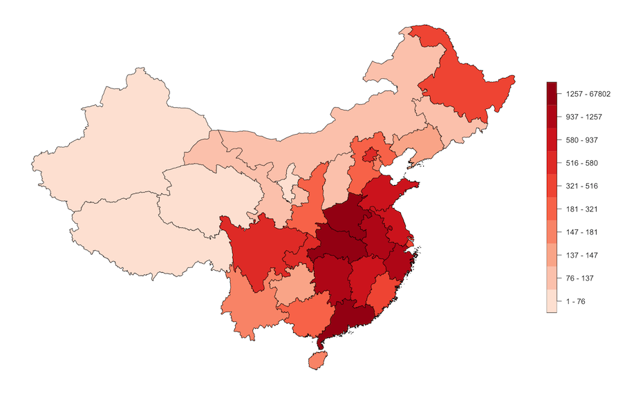
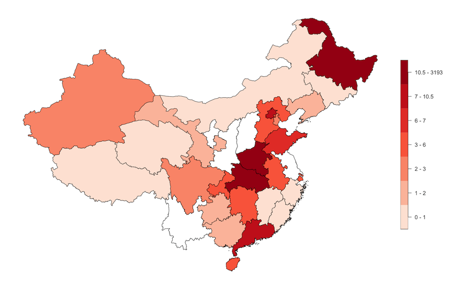
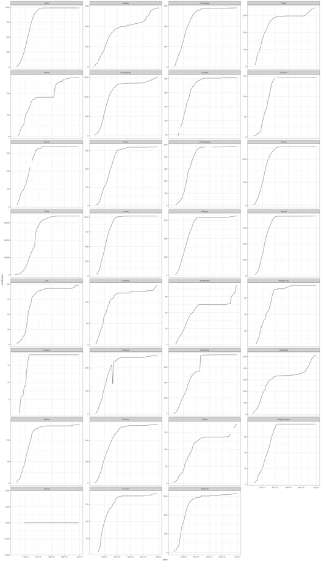

```{r, include = FALSE}
knitr::opts_chunk$set(
  message = FALSE,
  warning = FALSE,
  error = FALSE,
  collapse = TRUE,
  comment = "#>"
)
```

In this vignette, we show how to perform the OxCOVID19 Database visualisation examples shown [here](https://github.com/covid19db/examples/blob/master/data-plots/confirmed-adm-1-level-china.ipynb) using R and the `oxcovid19` package.

Here we further demonstrate the use of the `oxcovid19` functions in tandem with the `dplyr` functions to query the PostgreSQL server. In addition, we demonstrate the use of `sf` functions to retrieve the `administrative_division` which is a spatial layer of boundary shapes of various countries and various administrative units within countries.

## Retrieving epidemiology data for single source

This is similar to what we have already demonstrated in previous vignettes. Here we retrieve the epidemiology table and query it for records coming from `CHN_ICL` source and for records at the subnational level for China.

```{r example1, echo = TRUE, eval = TRUE}
library(oxcovid19)
library(magrittr)
library(dplyr)

connect_oxcovid19() %>%
  get_table(tbl_name = "epidemiology") %>%
  filter(source == "CHN_ICL",
         !is.na(adm_area_1)) %>%
  arrange(desc(date))
```

## Extracting only recent data - total per region

Then, here, we get the latest records for each subnational unit.

```{r example2a, echo = TRUE, eval = TRUE}
chn_recent_region <- connect_oxcovid19() %>%
  get_table(tbl_name = "epidemiology") %>%
  filter(source == "CHN_ICL",
         !is.na(adm_area_1)) %>%
  group_by(adm_area_1) %>%
  filter(as.Date(date) == max(as.Date(date), na.rm = TRUE)) %>%
  select(date, country, adm_area_1, confirmed, recovered, dead, gid) %>%
  collect()
```

```{r example2b, echo = FALSE, eval = TRUE}
chn_recent_region
```

## Retrieving administrative division level 1 for single country

In this step, we retrieve the spatial layer for China at subnational level from the server using the function `get_layer`. The resulting output is an `sf` class object.

```{r example3a, echo = TRUE, eval = TRUE}
chn_admin_1 <- connect_oxcovid19() %>%
  get_layer(ccode = "CHN", adm = 1) %>%
  collect()
```

```{r example3b, echo = FALSE, eval = TRUE}
chn_admin_1
```

## Merge administrative division and epidemiology data

Using the epidemiology data and the spatial layer we've retrieved, we create an overall spatial layer object for epidemiology data.

```{r example4a, echo = TRUE, eval = TRUE}
## Load sf package for spatial objects
library(sf)

chn_recent_region <- chn_recent_region %>%
  mutate(gid = as.character(stringr::str_remove_all(string = gid, 
                                                    pattern = "\\{|\\}"))) %>%
  left_join(y = chn_admin_1, by = "gid") %>%
  st_as_sf()
```

```{r example4b, echo = FALSE, eval = TRUE}
chn_recent_region
```

## Plot epidemiology total confirmed

Using the spatial layer object of epidemiology data in subnational units of China, we can create choropleth maps. Here we map the confirmed cases per subnational unit in China.

```{r example5, echo = FALSE, eval = TRUE}
chn_recent_region <- chn_recent_region %>%
  mutate(confirmed_class = cut(chn_recent_region$confirmed, 
                               breaks = quantile(x = chn_recent_region$confirmed, 
                                                 probs = seq(from = 0, 
                                                             to = 1, 
                                                             by = 0.1)),
                               include.lowest = TRUE))

levels(chn_recent_region$confirmed_class) <- levels(chn_recent_region$confirmed_class) %>%
  stringr::str_replace_all(pattern = ",", replacement = " - ") %>%
  stringr::str_replace_all(pattern = "1.26e\\+03", replacement = "1257") %>%
  stringr::str_replace_all(pattern = "6.78e\\+04", replacement = "67802") %>%
  stringr::str_remove_all(pattern = "\\[|\\]|\\(")
```

```{r example5a, echo = TRUE, eval = FALSE, fig.width = 7, fig.align = "center"}
chn_recent_region <- chn_recent_region %>%
  mutate(confirmed_class = cut(chn_recent_region$confirmed, 
                               breaks = quantile(x = chn_recent_region$confirmed, 
                                                 probs = seq(from = 0, 
                                                             to = 1, 
                                                             by = 0.1)),
                               include.lowest = TRUE))

levels(chn_recent_region$confirmed_class) <- levels(chn_recent_region$confirmed_class) %>%
  stringr::str_replace_all(pattern = ",", replacement = " - ") %>%
  stringr::str_replace_all(pattern = "1.26e\\+03", replacement = "1257") %>%
  stringr::str_replace_all(pattern = "6.78e\\+04", replacement = "67802") %>%
  stringr::str_remove_all(pattern = "\\[|\\]|\\(")
  
plot(chn_recent_region["confirmed_class"],
     main = "",
     pal = colorRampPalette(colors = RColorBrewer::brewer.pal(n = 5, 
                                                              name = "Reds"))(10),
     nbreaks = 10,
     breaks = "quantile",
     key.width = lcm(5))
```

```{r example5b, echo = FALSE, eval = TRUE, fig.align = "center", out.width = "75%"}

```

## Plot epidemiology total death

Here we map the deaths per subnational unit in China.

```{r example6, echo = FALSE, eval = TRUE}
chn_recent_region <- chn_recent_region %>%
  mutate(dead_class = cut(chn_recent_region$dead, 
                               breaks = unique(quantile(x = chn_recent_region$dead, 
                                                probs = seq(from = 0, 
                                                            to = 1, 
                                                            by = 0.1),
                                                 na.rm = TRUE)),
                               include.lowest = TRUE))

levels(chn_recent_region$dead_class) <- levels(chn_recent_region$dead_class) %>%
  stringr::str_replace_all(pattern = ",", replacement = " - ") %>%
  stringr::str_replace_all(pattern = "3.19e\\+03", replacement = "3193") %>%
  stringr::str_remove_all(pattern = "\\[|\\]|\\(")
```

```{r example6a, echo = TRUE, eval = FALSE, fig.width = 7, fig.align = "center"}
chn_recent_region <- chn_recent_region %>%
  mutate(dead_class = cut(chn_recent_region$dead, 
                               breaks = unique(quantile(x = chn_recent_region$dead, 
                                                probs = seq(from = 0, 
                                                            to = 1, 
                                                            by = 0.1),
                                                 na.rm = TRUE)),
                               include.lowest = TRUE))

levels(chn_recent_region$dead_class) <- levels(chn_recent_region$dead_class) %>%
  stringr::str_replace_all(pattern = ",", replacement = " - ") %>%
  stringr::str_replace_all(pattern = "3.19e\\+03", replacement = "3193") %>%
  stringr::str_remove_all(pattern = "\\[|\\]|\\(")
  
plot(chn_recent_region["dead_class"],
     main = "",
     pal = colorRampPalette(colors = RColorBrewer::brewer.pal(n = 5, 
                                                              name = "Reds"))(7),
     nbreaks = 7,
     breaks = "quantile",
     key.width = lcm(5))
```

```{r example6b, echo = FALSE, eval = TRUE, fig.align = "center", out.width = "75%"}

```

## Check monotonicity of data - confirmed

In the example from the Oxford COVID-19 Database, epidemiology data was checked for monotonicity. It is expected that epidemiology data is monotonic as these variables are expected to increase over time given that the information is cumulative. Monotonicity was checked by plotting a time series of cases and deaths with the expectation that the line plots will be on an increasing trajectory over time. Any instance of dips in the time series would indicate violation of monotonicity and an indication of issues with the data.

In the Oxford COVID-19 Database example, time series line plot for each subnational unit was plotted on the same axis as shown below.

```{r example7a, echo = TRUE, eval = FALSE, fig.width = 10, fig.height = 8, fig.align = "center"}
library(ggplot2)

connect_oxcovid19() %>%
  get_table(tbl_name = "epidemiology") %>%
  filter(source == "CHN_ICL",
         !is.na(adm_area_1)) %>%
  arrange(desc(date)) %>%
  ggplot(mapping = aes(x = date, y = confirmed, colour = adm_area_1)) +
  geom_line() +
  geom_point() +
  scale_colour_discrete(name = NULL) +
  theme_minimal()
```

```{r example7aa, echo = FALSE, eval = TRUE, fig.align = "center", out.width = "75%"}
knitr::include_graphics("../man/figures/visualisation_china_3.png")
```

Given that Hubei province had the most cases compared to all subnational units, the plot shows one time series curve with significantly more cases that anywhere else whilst all other units had a flat time series curve. This is not necessarily a good way to check monotonicity in all units as only Hubei province time series information is shown clearly.

In the plot below, we try to more clearly distinguish the time series for each subnational unit by showing a line plot for each unit separate. However, this only solves the issue of time series line plots being clearly demarcated from others. The curves, however, still does not show the true pattern for all units other than Hubei.

```{r example7b, echo = TRUE, eval = FALSE, fig.width = 10, fig.height = 17.5, fig.align = "center"}
connect_oxcovid19() %>%
  get_table(tbl_name = "epidemiology") %>%
  filter(source == "CHN_ICL",
         !is.na(adm_area_1)) %>%
  arrange(desc(date)) %>%
  ggplot(mapping = aes(x = date, y = confirmed)) +
  geom_line() +
  facet_wrap( ~ adm_area_1, ncol = 4) +
  theme_bw()
```

```{r example7bb, echo = FALSE, eval = TRUE, fig.align = "center", out.width = "75%"}
knitr::include_graphics("../man/figures/visualisation_china_4.png")
```

We address this by allowing the y-axis for each subnational time series plot to be appropriate for the data for the specific unit as below. Here we are able to see the time series plots for each subunit and able to verify whether monotonicity is observed.

```{r example7c, echo = TRUE, eval = FALSE, fig.width = 10, fig.height = 17.5, fig.align = "center"}
connect_oxcovid19() %>%
  get_table(tbl_name = "epidemiology") %>%
  filter(source == "CHN_ICL",
         !is.na(adm_area_1)) %>%
  arrange(desc(date)) %>%
  ggplot(mapping = aes(x = date, y = confirmed)) +
  geom_line() +
  facet_wrap( ~ adm_area_1, ncol = 4, scales = "free_y") +
  theme_bw()
```

```{r example7cc, echo = FALSE, eval = TRUE, fig.align = "center", out.width = "75%"}

```

Unfortunately, one subnational unit (Shaanxi Province) has a dip in cases within the time series plot which breaks monotonicity. This would indicate something inconsistent with the data. This needs to be checked.

## Check monotonicity of data - dead

In the next plots, we perform the same procedures but with the data on deaths. All subnational units demonstrate monotonicity with regard to number of deaths.

```{r example8a, echo = TRUE, eval = FALSE, fig.width = 10, fig.height = 17.5, fig.align = "center"}
connect_oxcovid19() %>%
  get_table(tbl_name = "epidemiology") %>%
  filter(source == "CHN_ICL",
         !is.na(adm_area_1)) %>%
  arrange(desc(date)) %>%
  ggplot(mapping = aes(x = date, y = dead)) +
  geom_line() +
  facet_wrap( ~ adm_area_1, ncol = 4) +
  theme_bw()
```

```{r example8aa, echo = FALSE, eval = TRUE, fig.align = "center", out.width = "75%"}
knitr::include_graphics("../man/figures/visualisation_china_6.png")
```

```{r example8b, echo = TRUE, eval = FALSE, fig.width = 10, fig.height = 17.5, fig.align = "center"}
connect_oxcovid19() %>%
  get_table(tbl_name = "epidemiology") %>%
  filter(source == "CHN_ICL",
         !is.na(adm_area_1)) %>%
  arrange(desc(date)) %>%
  ggplot(mapping = aes(x = date, y = dead)) +
  geom_line() +
  facet_wrap( ~ adm_area_1, ncol = 4, scales = "free_y") +
  theme_bw()
```

```{r example8bb, echo = FALSE, eval = TRUE, fig.align = "center", out.width = "75%"}
knitr::include_graphics("../man/figures/visualisation_china_7.png")
```
